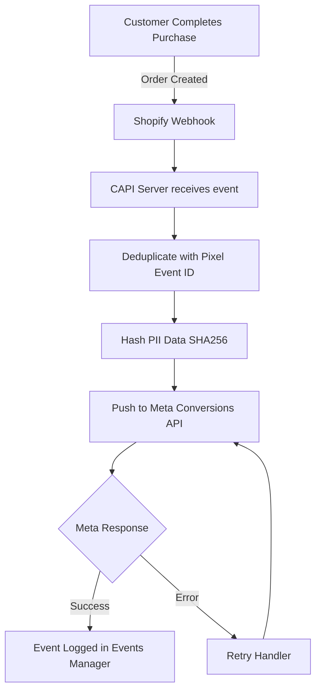

# Shopify Meta CAPI


A server-side Meta Conversions API integration for Shopify stores. Bypasses browser ad blockers, deduplicates pixel events, and pushes accurate purchase data directly to Meta for better ROAS and lower customer acquisition costs.

---

## The Problem This Solves

Browser-side Meta pixels are dying. Ad blockers, iOS 14+ privacy changes, and Safari ITP are killing your pixel match rate. Most stores are running at 40% to 60% data loss without knowing it. Every missed event means Meta's algorithm is optimizing on incomplete data, burning your ad budget on the wrong audience.

This integration pushes conversion events server side, directly from Shopify to Meta. No browser. No ad blocker. No data loss.

---

## Architecture



---

## Key Features

| Feature | Description |
|---|---|
| Server side tracking | Events fire from server not browser |
| Deduplication | Prevents double counting with browser pixel |
| PII hashing | SHA256 hashes all customer data before sending |
| Retry logic | Automatically retries failed events |
| Purchase tracking | Captures order value, currency and product data |
| PageView tracking | Server side page view events |

---

## Sample Event Payload

**Outgoing to Meta CAPI:**
```json
{
  "data": [
    {
      "event_name": "Purchase",
      "event_time": 1716998400,
      "event_id": "order_1234",
      "event_source_url": "https://yourstore.com/checkout",
      "action_source": "website",
      "user_data": {
        "em": "sha256_hashed_email",
        "ph": "sha256_hashed_phone",
        "client_ip_address": "192.168.1.1",
        "client_user_agent": "Mozilla/5.0"
      },
      "custom_data": {
        "currency": "USD",
        "value": "149.99",
        "order_id": "1234",
        "content_type": "product"
      }
    }
  ]
}
```

**Meta Response:**
```json
{
  "events_received": 1,
  "messages": [],
  "fbtrace_id": "abc123"
}
```

---

## Quick Start

```bash
git clone https://github.com/Waynelynx12/shopify-meta-capi.git
cd shopify-meta-capi
npm install
cp .env.example .env
npm run dev
```

---

## Environment Variables

| Variable | Description |
|---|---|
| META_PIXEL_ID | Your Meta Pixel ID from Events Manager |
| META_ACCESS_TOKEN | System user access token from Meta Business |
| SHOPIFY_WEBHOOK_SECRET | Webhook secret from Shopify Admin |
| PORT | Server port, defaults to 3000 |

---

## Built By

Sheriff Wayne, Growth Engineer and Shopify Technical Specialist. I build server side tracking infrastructure for ecommerce stores running Meta Ads that need accurate conversion data to scale profitably.
